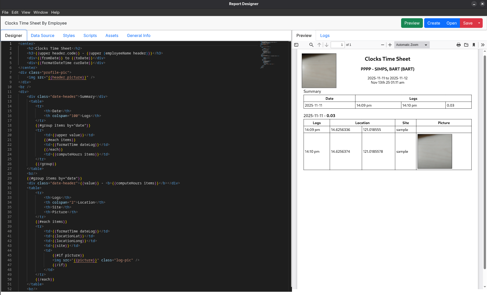
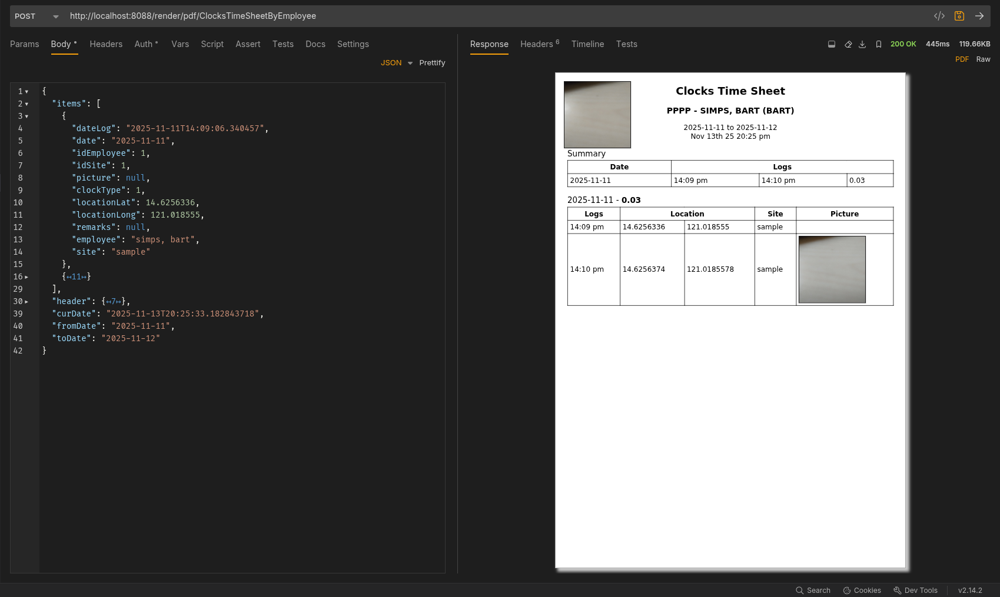

# Generic Report Designer

Screenshot

Sample Postman request using live data


Written in javascript under electron js
- editor uses Handlebars.js as templating engine https://handlebarsjs.com/
- supports local resources to handle images via `{{resource '[guid]'}}` snippet
- allow adding custom js libraries like charts and qrcodes
- allow async loading for internet dependent files


### build
```bash
npm install
npm run dist
# for windows
npm run dist:win
```
copy the executable from <workspace>/dist/Report Designer-1.0.0-x86_64.AppImage and paste somewhere else 
open terminal and look for the chrome executable file 

```bash
whereis google-chrome-stable
```

create environment file .env alongside the executable and write the config below, path should come from the whereis result command

```bash
CHROME_PATH=/usr/bin/google-chrome-stable
LIBS=/home/libs
```

* file is save as <filename>.zrpt which used BSON encoding
* add your javascript library in libs folder and create a handlebar helper, see QRCode sample below

# Report Server

```text
run docker-compose.yml
copy libs folder to temp
if needed, from temp/linux*, extract the chrome package
```
### alternative Dokploy

in dokploy service. create using compose and copy the Dokploy.txt

goto to created service folder
- update the libs files if your local libs has custom modification
```bash
cd /etc/dokploy/compose/reportserver-report-b0ruel/files
sudo chmod 777 /etc/dokploy/compose/reportserver-report-b0ruel/files
mkdir report
cp libs /etc/dokploy/compose/reportserver-report-b0ruel/files/
```

#### Get Request
```curl
curl --request GET \
  --url http://localhost:8088/render/tpl-issuance-history.zrpt/ppp.json \
  --header 'accept: text/plain'
```
- make sure tpl-issuance-history.zrpt exists in temp/report
- make sure ppp.json exists in temp/data

#### Post Request (Base64 data)
```curl
curl --request POST \
  --url http://localhost:8088/render/text/tpl-issuance-history \
  --header 'accept: text/plain' \
  --header 'content-type: application/json' \
  --data '<json data here>'
```

#### Post Request (Pdf Inline data)
```curl
curl --request POST \
  --url http://localhost:8088/render/pdf/tpl-issuance-history \
  --header 'accept: text/plain' \
  --header 'content-type: application/json' \
  --data '<json data here>'
```

#### QR Code
add this to Scripts
```js 
Handlebars.registerHelper('qrcode', function (data) {
  qrcode.stringToBytes = qrcode.stringToBytesFuncs['UTF-8'];

  var qr = qrcode(4, 'M');
  qr.addData(data, 'Byte');
  qr.make();
 
  return qr.createDataURL(50);
});
```
sample code
```html

```

use the js lib and configuration here: https://kazuhikoarase.github.io/qrcode-generator/js/demo/