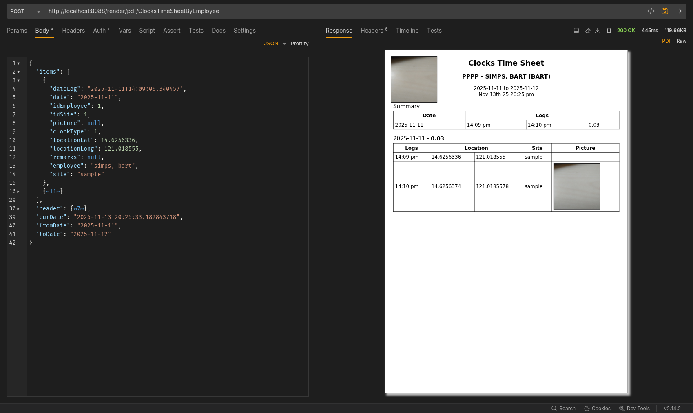

# Generic Report Designer

PDF reports from Handlebars templates: designed in VS Code, rendered by a report server.

| Folder | |
|---|---|
| [`vscode-extension/`](vscode-extension/) | The designer: a VS Code extension that opens `.zrpt` reports, with a visual builder, live preview and publishing. See its [README](vscode-extension/README.md). |
| [`report-server/`](report-server/) | Kotlin / Spring Boot server that renders published templates to PDF (Docker image `tofilagman/report-server`) |
| [`report-server-netcore/`](report-server-netcore/) | .NET library (`z.Report.Server`) for rendering reports inside your own application |
| [`libs/`](libs/) | Shared JavaScript libraries injected into every render: Handlebars, moment, chart.js, qrcode and `Processor.js` |

- templates use [Handlebars](https://handlebarsjs.com/)
- images are embedded as resources and referenced with `{{resource '[guid]'}}`
- custom JS libraries such as charts and QR codes go in `libs/`, with a Handlebars helper (see the QR code sample below)
- reports are saved as `.zrpt` files (BSON)

Sample Postman request using live data


## Designer

Build and install the VS Code extension:

```bash
cd vscode-extension
npm install
npm run package
code --install-extension report-designer-0.2.0.vsix
```

Opening a `.zrpt` file then opens the designer. Each project folder has a `report-designer.toml` that points at its `libs` folder and the report servers to publish to.

# Report Server

### Security

Set `REPORT_SERVER_KEY` on the server and every request (publish, library sync, test connection and rendering) must send it as `Authorization: Bearer <key>`. Without it the server answers `401`. Only the Swagger docs at `/docs` stay open.

```bash
# generate a key (64 hex characters; the server refuses keys shorter than 32)
openssl rand -hex 32
```

- **docker-compose / Dokploy:** set `REPORT_SERVER_KEY` in the environment; the compose files pass it through.
- **VS Code extension:** add `key = "…"` to the target in `report-designer.toml` (each target has its own URL and key), or keep it out of the file with **Report Designer: Set Server API Key**, which stores it in the OS keychain.

If `REPORT_SERVER_KEY` isn't set the server stays open and logs a warning at startup, so existing deployments keep running until a key is added.

```text
run docker-compose.yml
copy libs folder to temp
if needed, from temp/linux*, extract the chrome package
```
### alternative Dokploy

in dokploy service. create using compose and copy the Dokploy.txt

goto to created service folder
- update the libs files if your local libs has custom modification
```bash
cd /etc/dokploy/compose/reportserver-report-b0ruel/files
sudo chmod 777 /etc/dokploy/compose/reportserver-report-b0ruel/files
mkdir report
cp libs /etc/dokploy/compose/reportserver-report-b0ruel/files/
```

#### Get Request
```curl
curl --request GET \
  --url http://localhost:8088/render/tpl-issuance-history.zrpt/ppp.json \
  --header 'accept: text/plain' \
  --header "Authorization: Bearer $REPORT_SERVER_KEY"
```
- make sure tpl-issuance-history.zrpt exists in temp/report
- make sure ppp.json exists in temp/data

#### Post Request (Base64 data)
```curl
curl --request POST \
  --url http://localhost:8088/render/text/tpl-issuance-history \
  --header 'accept: text/plain' \
  --header "Authorization: Bearer $REPORT_SERVER_KEY" \
  --header 'content-type: application/json' \
  --data '<json data here>'
```

#### Post Request (Pdf Inline data)
```curl
curl --request POST \
  --url http://localhost:8088/render/pdf/tpl-issuance-history \
  --header 'accept: text/plain' \
  --header "Authorization: Bearer $REPORT_SERVER_KEY" \
  --header 'content-type: application/json' \
  --data '<json data here>'
```

#### QR Code
add this to Scripts
```js 
Handlebars.registerHelper('qrcode', function (data) {
  qrcode.stringToBytes = qrcode.stringToBytesFuncs['UTF-8'];

  var qr = qrcode(4, 'M');
  qr.addData(data, 'Byte');
  qr.make();
 
  return qr.createDataURL(50);
});
```
sample code
```html

```

use the js lib and configuration here: https://kazuhikoarase.github.io/qrcode-generator/js/demo/